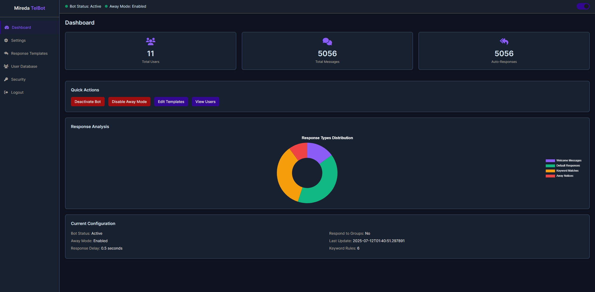
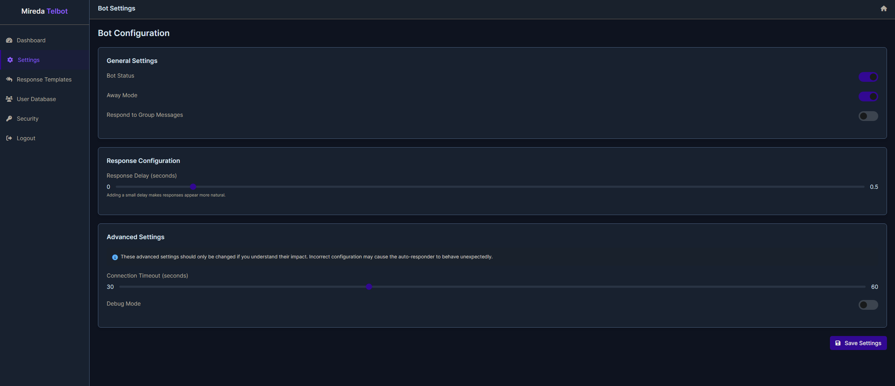
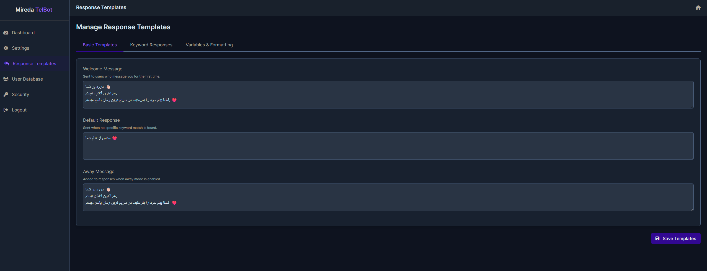
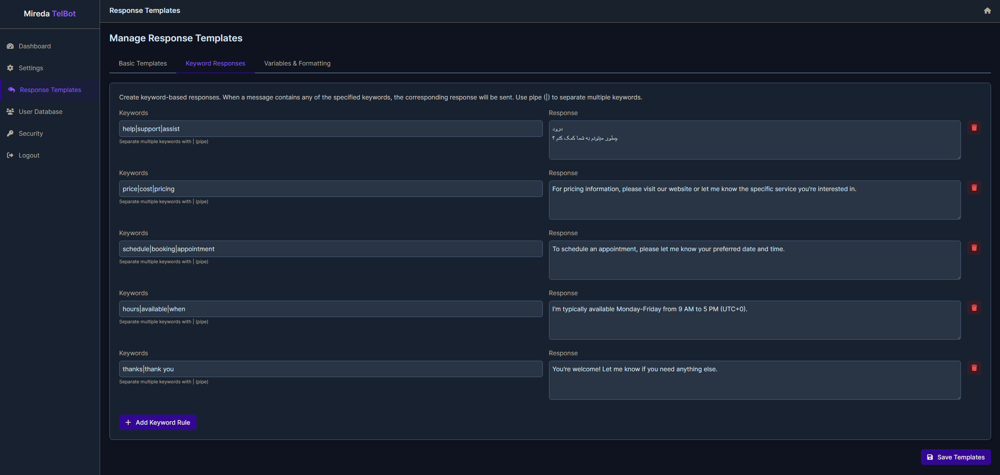

# Mireda TelBot

A Telegram auto-responder bot with a web-based control panel for managing responses, templates, and user interactions.

## Preview

### Web Management Panel

- **Dashboard**: Overview of bot status, user statistics, and recent activity


- **Settings**: Configure bot behavior, response delays, and operational modes



- **Templates**: Manage response templates and keyword-based replies

## Features

- 🤖 **Intelligent Auto-Response**: Automatically responds to incoming messages with customizable templates
- 🌐 **Web Control Panel**: Modern web interface for managing bot settings
- 📝 **Template Management**: Create and manage response templates with keyword matching
- 👥 **User Database**: Track user interactions and message history
- 🔄 **Real-time Updates**: Live configuration updates without restarting the bot
- 🌙 **Away Mode**: Special away messages for when you're unavailable
- 📊 **Analytics Dashboard**: Monitor bot performance and user statistics
- 🔐 **Secure Authentication**: Protected admin panel with customizable credentials
- ⚙️ **Flexible Configuration**: Adjustable response delays and group message handling

## Installation

### Prerequisites

- Python 3.7 or higher
- Telegram account and API credentials
- Git (for cloning the repository)

### Quick Start

1. **Clone the repository**
   ```bash
   git clone https://github.com/miredaw/TelBot.git
   cd TelBot
   ```

2.1 **Install dependencies**
   ```bash
   pip install -r requirements.txt
   ```

2.2 **Install Python dependencies**
   ```bash
   pip install telethon python-dotenv flask flask-socketio
   ```

3. **Get Telegram API credentials**
   - Go to [my.telegram.org](https://my.telegram.org)
   - Log in with your phone number
   - Go to "API Development Tools"
   - Create a new application
   - Copy your `API_ID` and `API_HASH`

4. **Create environment file**
   ```bash
   touch .env
   ```
   
   Add the following to `.env`:
   ```
   API_ID=your_api_id_here
   API_HASH=your_api_hash_here
   PHONE_NUMBER=your_phone_number_here
   ```

5. **Start the web panel**
   ```bash
   python web.py
   ```

6. **Start the bot** (in another terminal)
   ```bash
   python bot.py
   ```

## Configuration

### Environment Variables

| Variable | Description | Required |
|----------|-------------|----------|
| `API_ID` | Telegram API ID from my.telegram.org | Yes |
| `API_HASH` | Telegram API Hash from my.telegram.org | Yes |
| `PHONE_NUMBER` | Your phone number (with country code) | Yes |

### First Time Setup

1. **Web Panel Setup**
   - Navigate to `http://localhost:5000`
   - Complete the initial setup by creating admin credentials
   - Default credentials (if not set up): `admin` / `admin`

2. **Bot Authentication**
   - Run the bot for the first time
   - Enter the verification code sent to your Telegram account
   - The bot will create a session file for future use

## Usage

### Web Control Panel

Access the web panel at `http://localhost:5000`

#### Dashboard
- View bot status and statistics
- Monitor user interactions
- Quick toggle for bot activation

#### Settings
- **Bot Active**: Enable/disable the auto-responder
- **Away Mode**: Activate away messages
- **Response Delay**: Set delay between receiving and responding to messages
- **Group Responses**: Enable responses in group chats

#### Templates
- **Welcome Message**: First-time user greeting
- **Default Response**: Standard auto-response message
- **Away Message**: Message sent when away mode is active
- **Keyword Responses**: Custom responses for specific keywords

#### User Management
- View all users who have interacted with the bot
- See message counts and contact timestamps
- Export user data

### Telegram Commands

Control the bot directly from Telegram:

```
/bot on          - Activate the bot
/bot off         - Deactivate the bot
/bot away on     - Enable away mode
/bot away off    - Disable away mode
/bot set away [message] - Set custom away message
/bot status      - Show current bot status
/bot help        - Show available commands
```

### Template Variables

Use these variables in your response templates:

- `{name}` - User's first name
- `{full_name}` - User's full name
- `{username}` - User's username
- `{date}` - Current date
- `{time}` - Current time

Example template:
```
Hi {name}! Thanks for your message. I'll respond as soon as possible.
```

## File Structure

```
TelBot/
├── bot.py     # Main bot script
├── web.py        # Web panel backend
├── templates/                  # HTML templates
│   ├── dashboard.html
│   ├── settings.html
│   ├── templates.html
│   ├── users.html
│   ├── login.html
│   └── setup.html
├── bot_config.json            # Bot configuration (auto-generated)
├── user_database.json         # User database (auto-generated)
├── response_templates.json    # Response templates (auto-generated)
├── admin_credentials.json     # Admin credentials (auto-generated)
├── madeline_session.session   # Telegram session (auto-generated)
├── .env                       # Environment variables
├── requirements.txt           # Python dependencies
└── README.md                  # This file
```

## API Endpoints

### Authentication Required

- `GET /` - Dashboard
- `GET /settings` - Settings page
- `GET /templates` - Template management
- `GET /users` - User list
- `POST /api/toggle-bot` - Toggle bot status
- `POST /api/toggle-away` - Toggle away mode

### Public Endpoints

- `GET /api/bot-status` - Get current bot status
- `GET /login` - Login page
- `GET /setup` - Initial setup page

## Security Features

- **Session Management**: Secure session handling
- **Authentication**: Required login for all administrative functions
- **Password Protection**: Customizable admin credentials
- **Setup Wizard**: Guided initial configuration

## Troubleshooting

### Common Issues

1. **"Invalid API ID/Hash"**
   - Verify your API credentials in `.env`
   - Ensure no extra spaces in the credentials

2. **"Phone number not registered"**
   - Make sure your phone number includes the country code
   - Format: `+1234567890`

3. **"Session file error"**
   - Delete the session file and re-authenticate
   - `rm madeline_session.session`

4. **"Web panel not accessible"**
   - Check if Flask is running on port 5000
   - Verify firewall settings


## Acknowledgments

- [Telethon](https://github.com/LonamiWebs/Telethon) - Telegram client library
- [Flask](https://flask.palletsprojects.com/) - Web framework
- [Socket.IO](https://socket.io/) - Real-time communication

---

⚠️ **Disclaimer**: This bot is for educational and personal use. Make sure to comply with Telegram's Terms of Service and local regulations when using automated messaging tools.
